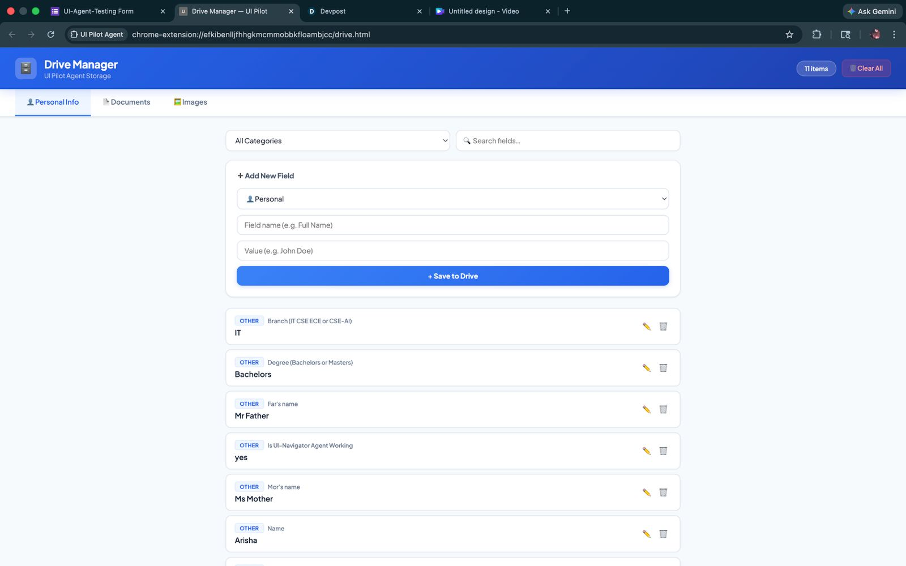
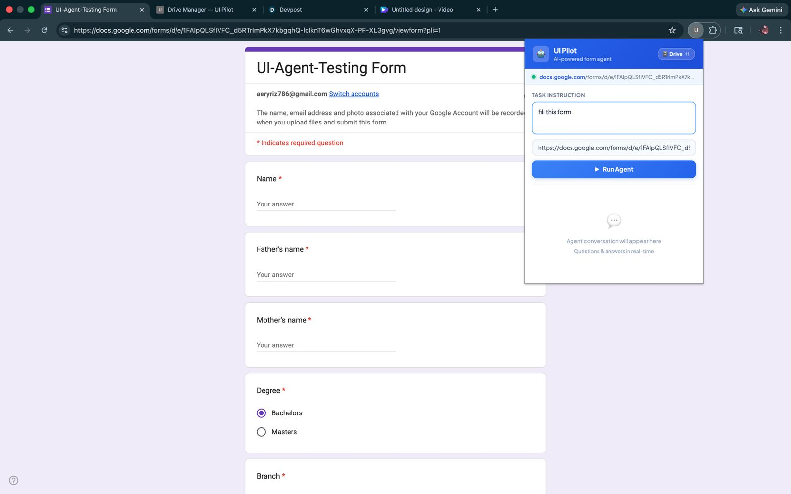

# UI Pilot — Universal Overlay Handler

An AI-powered browser automation agent that fills forms, clicks buttons, and navigates websites autonomously. It combines a **Chrome Extension** (the control panel) with a **Python backend** (Playwright + Gemini 2.0 Flash) to let you describe a task in plain English and watch the agent carry it out.





---

## How It Works

```
Chrome Extension (popup)
       │
       │  POST /run-agent  {instruction, url, user_data}
       ▼
FastAPI Server (app.py / server.py)
       │
       ├──► playwright_runner.py   — opens browser, collects elements, takes screenshot
       │
       └──► navigator.py (Gemini)  — reasons over screenshot + elements → next action
                    │
                    └──► executes action → loop until done
```

1. You type an instruction in the popup (e.g. *"Fill in the registration form with my details"*).
2. The extension sends the instruction + your stored profile data to the local FastAPI server.
3. `playwright_runner.py` opens a Chromium window, collects all interactive elements on the page, annotates a screenshot with numbered bounding boxes, and returns the payload.
4. `navigator.py` feeds the screenshot and element list to **Gemini 2.5 Flash** (via Vertex AI), which returns the single best next action as JSON.
5. The action is executed (click, type, scroll, key press, etc.) and the loop repeats until the task is complete.
6. If the agent needs information it doesn't have, it sends an `ask_user` response back to the extension, which shows a chat-style input box for you to answer. Answers can optionally be saved to Drive for future reuse.

---

## Features

- **Natural language control** — describe what you want in plain English
- **Annotated vision** — Gemini sees a screenshot with numbered element overlays, not just raw HTML
- **Smart element detection** — classifies buttons, inputs, textareas, dropdowns, links, radio buttons, and checkboxes
- **Drive storage** — a local IndexedDB vault (powered by Dexie.js) stores your personal info, documents, and images so the agent can autofill forms without re-entering data
- **Interactive Q&A** — the agent asks follow-up questions mid-task when it needs info; answers are shown in a chat UI inside the popup
- **Password masking** — password fields are automatically blurred in screenshots before being sent to the model
- **Windows compatible** — `server.py` sets the Proactor event loop policy for full Playwright support on Windows

---

## Project Structure

```
├── server.py              — Entry point; starts uvicorn with correct event loop
├── app.py                 — FastAPI app with /run-agent and /user-response endpoints
├── navigator.py           — Agent loop: Gemini reasoning + Playwright action execution
├── playwright_runner.py   — Element collection, screenshot capture, box annotation
│
├── manifest.json          — Chrome Extension manifest (MV3)
├── popup.html / popup.js  — Extension popup UI + run/answer logic
├── drive.html / drive.js  — Drive Manager UI (profile, documents, images)
├── drive.css              — Shared stylesheet
└── db.js                  — Dexie.js database schema and helpers
```

---

## Prerequisites

- Python 3.10+
- Node.js (for Playwright browser binaries)
- A Google Cloud project with Vertex AI enabled
- `gcloud` CLI authenticated (`gcloud auth application-default login`)

---

## Setup

### 1. Clone the repo

```bash
git clone https://github.com/genesis106/UniversalOverlayHandler.git
cd UniversalOverlayHandler
```

### 2. Install Python dependencies

```bash
pip install fastapi uvicorn playwright pillow google-genai python-dotenv
playwright install chromium
```

### 3. Configure environment variables

Create a `.env` file in the project root:

```env
GOOGLE_CLOUD_PROJECT=your-gcp-project-id
GOOGLE_CLOUD_LOCATION=us-central1
```

### 4. Start the backend server

```bash
python server.py
```

The server starts at `http://127.0.0.1:8000`.

### 5. Load the Chrome Extension

1. Open Chrome and go to `chrome://extensions`
2. Enable **Developer mode** (top right)
3. Click **Load unpacked** and select the project folder
4. The **UI Pilot** icon will appear in your toolbar

---

## Usage

### Running a task

1. Navigate to any webpage in Chrome
2. Click the **UI Pilot** extension icon
3. Type your instruction (e.g. *"Search for noise-cancelling headphones and add the first result to cart"*)
4. Optionally override the URL, or leave it blank to use the active tab
5. Click **▶ Run Agent**

### Drive Manager

Click the **🗄️ Drive** button in the popup to open the Drive Manager. Here you can:

- Store personal info (name, email, address, education, work history, etc.) organized by category
- Upload documents (PDF, DOC, DOCX) — resume, certificate, ID card, etc.
- Upload images (PNG, JPG, WEBP) — photos, signatures, ID scans

All stored data is sent to the agent at the start of each task so it can autofill forms without asking.

### Answering agent questions

If the agent encounters a field it can't fill from your Drive, it will pause and ask in the popup chat. Type your answer and press Enter. Check **"Save to Drive"** to store the answer for future tasks.

---

## Action Types

`playwright_runner.py` accepts the following `action_type` values to filter which elements are collected:

| Action Type | Elements Collected |
|---|---|
| `CLICK_BUTTON` | Buttons and submit inputs |
| `FILL_INPUT` | Text inputs and textareas |
| `SELECT_DROPDOWN` | Select elements and comboboxes |
| `CLICK_LINK` | Anchor tags |
| `SELECT_RADIO` | Radio buttons |
| `CLICK_INPUT_ALL` | Everything (default) |

---

## Configuration

| Variable | Default | Description |
|---|---|---|
| `GOOGLE_CLOUD_PROJECT` | *(required)* | GCP project ID for Vertex AI |
| `GOOGLE_CLOUD_LOCATION` | `us-central1` | Vertex AI region |
| `MAX_STEPS` | `30` | Maximum agent steps per task |

---

## Tech Stack

| Layer | Technology |
|---|---|
| Browser automation | Playwright (Python) |
| AI reasoning | Gemini 2.5 Flash via Vertex AI (`google-genai`) |
| Backend | FastAPI + Uvicorn |
| Chrome Extension | Manifest V3, vanilla JS |
| Local storage | Dexie.js (IndexedDB) |
| Image processing | Pillow |

---
