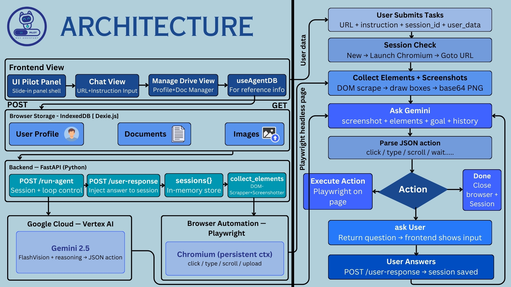

# UI Pilot : AI UI Navigator Agent

> Automate any web form or UI workflow using your personal data vault, powered by Gemini 2.5 Flash and Playwright.




---

## What is UI Pilot?

UI Pilot is an AI-powered browser automation agent that fills forms, navigates websites, and extracts data — using your own personal information stored locally. You give it a URL and a natural-language instruction. It opens a real Chrome browser, reads the page, reasons about what to do next using Gemini 2.0 Flash, and executes actions step by step until the task is complete.

All personal data (name, email, address, documents, photos) lives in your browser's IndexedDB — never on a server. The agent receives it only at the moment a task runs.

---

## Key Features

- **Natural language instructions** — "Fill this job application using my resume and contact details"
- **Personal data vault** — Store profile fields, documents (PDF/DOCX), and images locally in IndexedDB
- **Smart form filling** — Gemini reads the page screenshot + DOM elements and maps your Drive data to form fields semantically
- **Ask when unsure** — If required data is missing from your Drive, the agent pauses and asks you directly, then saves your answer for next time
- **File uploads** — Injects documents (resumes, ID cards, certificates) into file input fields, including Google Drive iframe pickers
- **Persistent Chrome session** — Uses a real Chrome profile so saved logins, cookies, and extensions carry over between runs
- **Zero hallucination policy** — The agent is strictly instructed never to guess or invent personal information

---

## Architecture Overview

```
┌─────────────────────────────────────────────────────┐
│  React Frontend (Vite)                               │
│                                                      │
│  UI Pilot Panel                                        │
│  ├── ChatView          ← URL + instruction input     │
│  │   └── calls /run-agent, handles ask_user loop     │
│  └── ManageDriveView   ← profile + doc manager       │
│      └── useAgentDB    ← Dexie/IndexedDB hook        │
└──────────────────┬──────────────────────────────────┘
                   │  POST /run-agent
                   │  POST /user-response
                   ▼
┌─────────────────────────────────────────────────────┐
│  FastAPI Backend (Python)                            │
│                                                      │
│  /run-agent     ← main agent loop (up to 30 steps)  │
│  /user-response ← injects user answer into session  │
│  sessions{}     ← in-memory session store           │
│  collect_elements_async  ← DOM scraper              │
│  draw_boxes      ← annotates screenshot for Gemini  │
└──────────┬────────────────────────┬─────────────────┘
           │                        │
           ▼                        ▼
┌──────────────────┐   ┌────────────────────────────┐
│  Vertex AI       │   │  Playwright (Chromium)      │
│  Gemini 2.0 Flash│   │  Persistent Chrome context  │
│  Vision + reason │   │  click/type/scroll/upload   │
└──────────────────┘   └────────────────────────────┘
```

### Agent loop (per step)

1. Collect all interactive DOM elements from the current page
2. Take a screenshot and annotate it with numbered bounding boxes
3. Send screenshot + element list + goal + history to Gemini
4. Gemini returns a single JSON action
5. Execute the action via Playwright
6. If action is `ask_user` → pause, return question to frontend, wait for answer
7. If action is `done` → clean up session, return summary
8. Otherwise → append to history, go to step 1

---

## Project Structure

```
cognito/
│
├── backend/
│   └── app.py                  # FastAPI server — agent loop, Playwright, Gemini
│
├── frontend/
│   └── src/
│       ├── components/cognito/
│       │   ├── CognitoPanel.tsx     # Slide-in panel shell, tab routing
│       │   ├── ChatView.tsx         # Chat UI + API integration
│       │   └── ManageDriveView.tsx  # Profile/doc/image manager
│       ├── hooks/
│       │   └── useAgentDB.ts        # Dexie IndexedDB wrapper + buildAgentPayload()
│       └── pages/
│           └── Index.tsx            # Landing page
│
├── chrome-extension/            # Legacy Chrome extension (optional)
│   ├── popup.html / popup.js
│   ├── drive.html / drive.js / drive.css
│   └── db.js                   # Dexie schema (mirrors useAgentDB.ts)
│
├── navigator.py                 # Standalone CLI agent (legacy)
├── playwright_runner.py         # Standalone element collector (legacy)
│
└── .env                        # Google Cloud credentials
```

---

## Prerequisites

| Requirement | Version |
|---|---|
| Python | 3.9+ |
| Node.js | 18+ |
| Google Chrome | Latest stable |
| Google Cloud project | With Vertex AI API enabled |

---

## Installation

### 1. Clone the repository

```bash
git clone https://github.com/your-org/UniversalOverlayHandler.git
cd UniversalOverlayHandler
```

### 2. Backend setup

```bash
cd backend
pip install fastapi uvicorn playwright pillow python-dotenv google-genai
playwright install chromium
```

Create a `.env` file in the `backend/` directory:

```env
GOOGLE_CLOUD_PROJECT=your-project-id
GOOGLE_CLOUD_LOCATION=us-central1
```

Place your Google Cloud service account JSON file in the `backend/` directory. The server auto-detects any `.json` file with `"type": "service_account"` in the same folder. Alternatively, set the environment variable explicitly:

```env
GOOGLE_APPLICATION_CREDENTIALS=/path/to/your-service-account.json
```

### 3. Frontend setup

```bash
cd frontend
npm install
npm install dexie
```

### 4. Verify Vertex AI access

Ensure your service account has the **Vertex AI User** role (`roles/aiplatform.user`) in your Google Cloud project, and that the Vertex AI API is enabled.

---

## Running the Project

### Start the backend

```bash
cd backend
uvicorn app:app --reload --port 8000
```

You should see:

```
🔑 Auto-detected service account: /path/to/key.json
🔐 Vertex AI — Project: your-project-id | SA: ...
INFO: Application startup complete.
```

### Start the frontend

```bash
cd frontend
npm run dev
```

Open `http://localhost:5173` in your browser. The UI Pilot panel slides in from the right.

---

## Usage

### Step 1 — Populate your Drive

Open the **Manage Drive** tab in the Cognito panel and add your personal information:

- **Personal** — Full Name, Date of Birth, Gender, etc.
- **Professional** — Company, Job Title, Skills, LinkedIn URL
- **Job Info** — Desired Role, Salary Expectation, Availability
- **Documents** — Upload your resume, certificates, ID cards (PDF/DOCX/image)
- **Images** — Profile photo, passport scan, signature

All data is stored locally in your browser's IndexedDB. Nothing is sent to any server until you run a task.

### Step 2 — Run a task

Switch to the **Chat** tab, paste a URL, type your instruction, and press Send:

```
URL:         https://jobs.example.com/apply/senior-engineer
Instruction: Fill this job application using my resume and professional details
```

The agent opens Chrome, navigates to the URL, and starts filling the form. You can watch it work in the browser window that appears.

### Step 3 — Answer questions (if prompted)

If the agent encounters a field it can't fill from your Drive, it pauses and asks you directly in the chat:

```
Agent: What is your mother's maiden name?
You:   [type answer]    ☑ Save to Drive for next time
```

Checking "Save to Drive" writes the answer to IndexedDB so the agent won't ask again in future sessions.

### Step 4 — Done

When the form is submitted and a confirmation page is visible, the agent reports back:

```
✅ Task complete!
Successfully submitted the application for Senior Engineer at Example Corp.
```

---

## API Reference

### `POST /run-agent`

Starts or resumes an agent session.

**Request body:**

```json
{
  "instruction": "Fill this contact form",
  "url": "https://example.com/contact",
  "action_type": "CLICK_INPUT_ALL",
  "session_id": "1718000000000",
  "user_data": {
    "profile": {
      "personal": { "Full Name": "Jane Doe", "Email": "jane@example.com" },
      "work":     { "Company": "TechCorp", "Job Title": "Engineer" }
    },
    "documents": [
      { "name": "Resume.pdf", "type": "resume", "mimeType": "application/pdf", "content": "<base64>" }
    ],
    "images": [
      { "name": "photo.jpg", "mimeType": "image/jpeg", "content": "<base64>" }
    ]
  }
}
```

**Responses:**

```json
{ "status": "ask_user", "question": "What is your father's name?" }
{ "status": "done",     "summary": "Form submitted successfully." }
{ "status": "error",    "message": "Browser closed unexpectedly." }
```

**`action_type` options:**

| Value | Selects |
|---|---|
| `CLICK_INPUT_ALL` | All interactive elements (default, recommended) |
| `CLICK_BUTTON` | Buttons and submit inputs only |
| `FILL_INPUT` | Text inputs and textareas only |
| `CLICK_LINK` | Anchor tags only |
| `SELECT_RADIO` | Radio buttons only |
| `SELECT_DROPDOWN` | Select elements and comboboxes |

---

### `POST /user-response`

Delivers the user's answer to a paused session.

**Request body:**

```json
{ "answer": "Robert Doe", "session_id": "1718000000000" }
```

**Response:**

```json
{ "status": "received" }
```

After this call, re-call `POST /run-agent` with the same `session_id` to continue the agent loop.

---

## Gemini Actions

Gemini returns exactly one JSON action per step. All available actions:

| Action | Shape | Effect |
|---|---|---|
| `click` | `{"action":"click","element_id":5}` | Mouse click at element center |
| `type` | `{"action":"type","element_id":3,"text":"..."}` | Type text into focused field |
| `clear_and_type` | `{"action":"clear_and_type","element_id":3,"text":"..."}` | Select all, then type |
| `upload_file` | `{"action":"upload_file","element_id":7,"filename":"Resume.pdf"}` | Inject file from Drive into file input |
| `scroll` | `{"action":"scroll","direction":"down"}` | Scroll page (down or up) |
| `key` | `{"action":"key","key":"Enter"}` | Press keyboard key |
| `wait` | `{"action":"wait","seconds":2}` | Pause for N seconds |
| `go_back` | `{"action":"go_back"}` | Browser back navigation |
| `ask_user` | `{"action":"ask_user","question":"..."}` | Pause loop, request info from user |
| `done` | `{"action":"done","summary":"..."}` | Task complete, close session |

**Anti-hallucination rules enforced in the system prompt:**
- Gemini must use semantic matching to map form fields to Drive data (e.g. "Far's Name" → "Father's Name")
- If required data is not in Drive, `ask_user` is mandatory — guessing is forbidden
- `done` is only allowed after a visible confirmation or success page

---

## Data Storage (IndexedDB Schema)

All data is stored locally using [Dexie.js](https://dexie.org/) in a database named `UIAgentDrive`.

### `profile` table

| Column | Type | Description |
|---|---|---|
| `key` | string (PK) | Field name, e.g. "Full Name" |
| `value` | string | Field value, e.g. "Jane Doe" |
| `category` | string | One of: personal, contact, education, work, financial, medical, social, other |

### `documents` table

| Column | Type | Description |
|---|---|---|
| `id` | number (auto) | Primary key |
| `name` | string | Filename, e.g. "Resume_2024.pdf" |
| `type` | string | resume / certificate / id_card / transcript / other |
| `content` | string | Base64-encoded file content |
| `mimeType` | string | e.g. "application/pdf" |
| `dateAdded` | string | ISO timestamp |

### `images` table

| Column | Type | Description |
|---|---|---|
| `id` | number (auto) | Primary key |
| `name` | string | Filename |
| `content` | string | Base64-encoded image |
| `mimeType` | string | e.g. "image/jpeg" |
| `dateAdded` | string | ISO timestamp |

---

## Session Lifecycle

Sessions are held in a Python dict (`sessions{}`) in memory on the FastAPI server. Each session stores:

```python
sessions[session_id] = {
    "p":           playwright_instance,
    "browser":     chromium_persistent_context,
    "page":        active_page,
    "history":     [list_of_past_actions],
    "goal":        original_instruction,
    "action_type": selector_strategy,
    "user_data":   drive_payload,
    # set transiently by /user-response, deleted after first Gemini read:
    "user_input":  "user answer string",
}
```

Sessions are destroyed (browser closed, memory freed) when:
- The agent emits `done`
- Max steps (30) are reached
- A `TargetClosedError` or unhandled exception occurs

> **Note:** Sessions are in-memory only. Restarting the server clears all sessions.

---

## Environment Variables

| Variable | Required | Default | Description |
|---|---|---|---|
| `GOOGLE_CLOUD_PROJECT` | Yes | — | GCP project ID |
| `GOOGLE_CLOUD_LOCATION` | No | `us-central1` | Vertex AI region |
| `GOOGLE_APPLICATION_CREDENTIALS` | No | auto-detected | Path to service account JSON |

---

## Troubleshooting

**`File .json was not found` on startup**

The service account JSON is missing or in the wrong location. Either set `GOOGLE_APPLICATION_CREDENTIALS` in your `.env`, or place the JSON file in the same directory as `app.py`.

**`TargetClosedError: Page.wait_for_timeout`**

The Chrome window was closed manually during a run, or the browser crashed. The server now catches this and returns `{"status":"error"}` instead of a 500. Start a new task to open a fresh browser.

**Agent asks for data you already added to Drive**

The field name in Drive may not match what Gemini is looking for. Try using the exact label the form uses (e.g. if the form says "Father's Name", add that exact key to Drive). Gemini does fuzzy matching but exact matches are more reliable.

**Form fills incorrectly / agent gets stuck**

Increase the `MAX_STEPS` value in `app.py` (default: 30) for long multi-page forms. For dynamic single-page apps, try adding a `wait` step by instructing the agent to "wait for the page to load before proceeding".

**CORS errors in the browser console**

Ensure the FastAPI server is running on port 8000 and the `API_BASE` constant at the top of `ChatView.tsx` matches. The backend allows all origins by default.

---

## Development Notes

### Adding a new Drive category

1. Add the category name to `PROFILE_CATEGORIES` in `db.js` and `useAgentDB.ts`
2. Add suggested field names to `FIELD_SUGGESTIONS` in both files
3. Add a tab entry in `ManageDriveView.tsx` and map it in `TAB_TO_CATEGORY`

### Changing the AI model

Update `MODEL_ID` in `app.py`. The system is tested with `gemini-2.0-flash`. Vision capability is required — ensure any replacement model supports image input.

### Running without a GUI (headless mode)

Change `headless=False` to `headless=True` in the `launch_persistent_context` call in `app.py`. Note that some sites detect headless Chrome and may behave differently.

### Chrome extension (legacy)

The `chrome-extension/` folder contains the original popup-based UI that predates the React frontend. It connects to the same FastAPI backend and uses the same `db.js` IndexedDB schema. It can be loaded unpacked in Chrome via `chrome://extensions` → "Load unpacked" for use as a browser sidebar.

---

## Security Considerations

- **Local data only** — Profile data never leaves your machine except as part of a `/run-agent` request to your local FastAPI server (127.0.0.1). The server is not exposed to the internet by default.
- **Service account key** — Keep your Google Cloud service account JSON out of version control. Add `*.json` to `.gitignore`.
- **Session isolation** — Each task gets a unique `session_id`. Sessions are isolated in memory and cannot access each other's data.
- **No auth on the API** — The FastAPI server has no authentication. Do not expose port 8000 to the public internet.

---

## Contributing

1. Fork the repository
2. Create a feature branch: `git checkout -b feature/my-feature`
3. Commit your changes: `git commit -m "add my feature"`
4. Push and open a pull request

Please open an issue first for significant changes.

---

## License

MIT — see [LICENSE](LICENSE) for details.

---

## Acknowledgements

- [Playwright](https://playwright.dev/) — browser automation
- [Gemini 2.0 Flash](https://cloud.google.com/vertex-ai/generative-ai/docs/model-reference/gemini) — vision + reasoning
- [Dexie.js](https://dexie.org/) — IndexedDB wrapper
- [FastAPI](https://fastapi.tiangolo.com/) — Python web framework
- [Framer Motion](https://www.framer.com/motion/) — React animations
